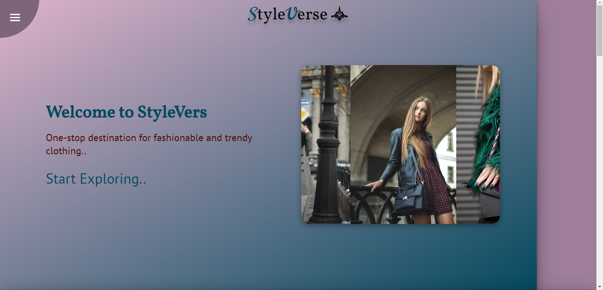
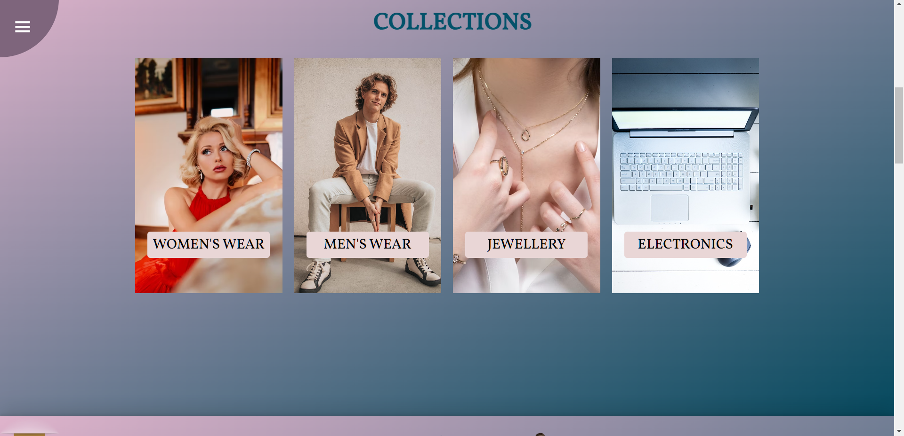
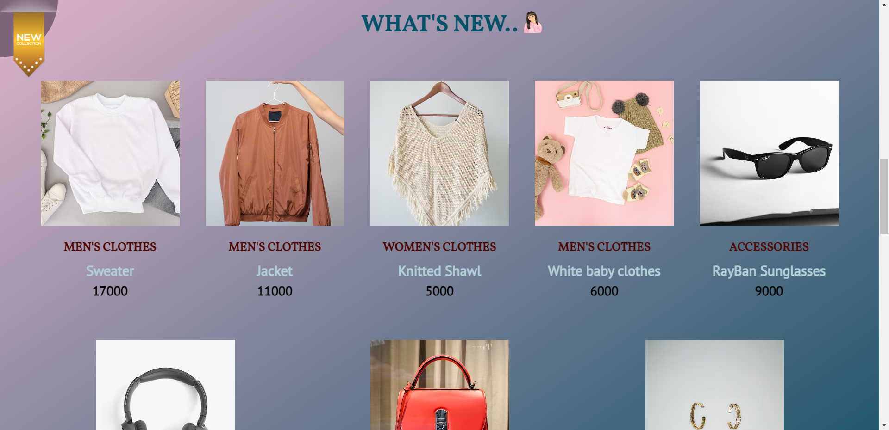
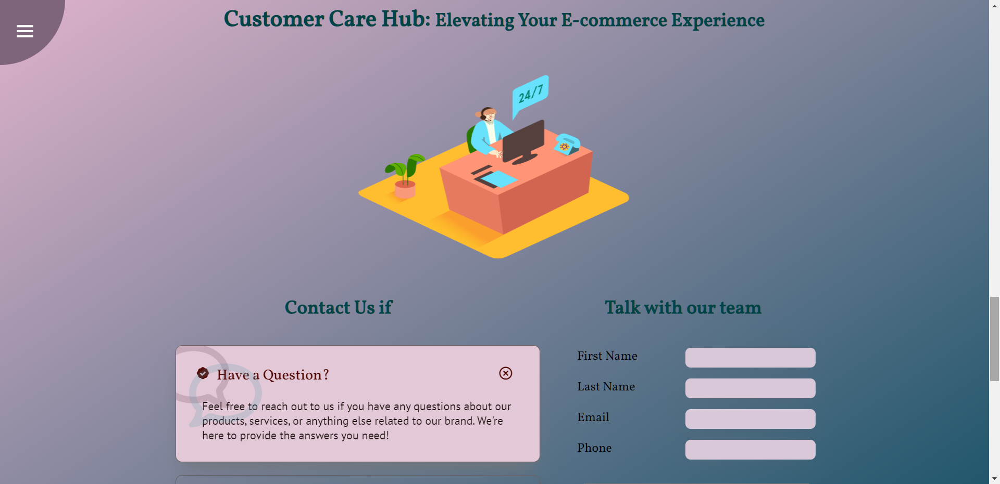
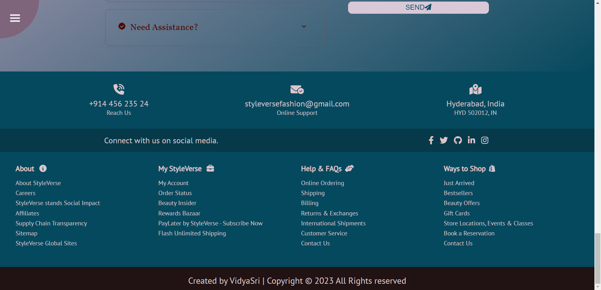
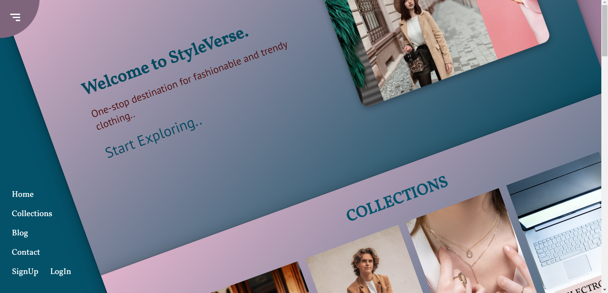

# StyleVerse Website

#### Description:

This website is a shopping clone that contains two pages:

The Main page consists of a rotating navigation menu, a home section, a collections section, a contact section.
The home section features a slideshow of models. The collections section features a list of different product categories followed by new arrivals.

The contact section provides information on why and how to contact the website owner. It also provides the store's address, phone number, and email address. 

The rotating navigation menu allows users to quickly navigate to different sections and pages of the website. 

The blog page consists of a blog section and a contact section.

The blog page features a list of blog posts as well as a search bar. The signup section in blog page allows users to subscribe to the blog.

The website includes a variety of animations, including a typing effect on the home page, a rotating navigation menu, and hover effects on the product images. The contact section is interactive. The website is focused on a better blend of colors, UI, and styling features with light JavaScript.

## Demo

Watch the demo video on [YouTube](https://youtu.be/Ybejqh6h3nk).

## Tech Stack

**Front End :** HTML, CSS, JavaScript

**IDE:** Visual Studio Code

